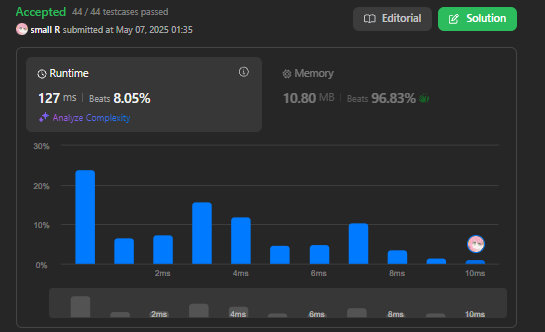

# 💡 LeetCode 402. Remove K Digits 題目筆記

## 🧠 題目理解

這道題的目的是讓我從一個代表整數的字串中移除 `k` 個數字，並使得剩下的數字組成最小的數字。還需要特別注意的是，移除數字後可能會有前導零，這些零需要被去除，最終返回的結果不能包含這些零。

---

## 🥹 初次的思路

一開始看到這道題的時候，我的第一反應是：「好像是每次刪掉一個數字，這樣會讓結果變得更小。」當時我聯想到的解法有點像是「Two Sum」的邏輯，用雙指標來比較兩數大小，找出最大的數字來刪除。

我試著用 `for` 迴圈來處理每一對相鄰的數字，但很快發現這樣的做法並不夠精確。於是我改用了 `while` 來尋找需要刪除的數字，並發現這樣的邏輯更符合題目的需求。

---

## 🧪 解題過程

我開始嘗試使用貪心算法，當我發現要刪除的數字之後，我就選擇刪除它。每次刪除一個數字後，我就讓 `k` 減少一次，直到刪掉 `k` 個數字為止。

接著，我也發現題目有一個特殊要求，就是需要處理前導零。因此，我決定先處理刪除數字的邏輯，再用 `substr` 來去除字串中的前導零。

### **初次嘗試失敗的代碼**

一開始，我先用了 `while` 來處理邏輯，但遇到了一些問題，最終提交後結果並不正確。我的思路是想用雙指標來找出需要刪除的數字，但還是未能順利解決問題。

```cpp
string removeKdigits(string num, int k) {
    while (k > 0) {
        int i = 0;

        // 尋找要刪除的數字
        while (i < num.size() - 1 && num[i] < num[i + 1])
            i++;

        // 刪除該數字
        num.erase(i, 1);
        k--;
    }

    // 移除前導零
    int start = 0;
    while (start < num.size() && num[start] == '0') {
        start++;
    }

    // 返回處理後的數字
    string result = num.substr(start);
    return result.empty() ? "0" : result;
}
```

這段代碼沒有達到預期效果，因為我沒有考慮清楚如何處理剩下的數字。

### **最終成功的解法**

經過進一步的思考，我發現可以嘗試從左到右遍歷字串，對每一個數字進行處理，當遇到較小的數字時，刪除前一個較大的數字，這樣可以確保結果是最小的。

最終的成功代碼如下：

```cpp
string removeKdigits(string num, int k)
{
    // 用來處理數字
    int n = num.size();

    // 遍歷每一個數字
    for (int i = 0; i < n && k > 0; i++)
    {
        // 當遇到較小的數字時，刪除前一個較大的數字
        while (k > 0 && i > 0 && num[i] < num[i - 1])
        {
            num.erase(i - 1, 1);
            k--;
            i--;
        }
    }

    // 如果還有剩餘的k，則刪除最後的幾個數字
    while (k > 0)
    {
        num.erase(num.size() - 1, 1);
        k--;
    }

    // 移除前導零
    int start = 0;
    while (start < num.size() && num[start] == '0')
    {
        start++;
    }

    string result = num.substr(start);

    // 如果結果是空的，返回"0"
    return result.empty() ? "0" : result;
}
```



### 關鍵步驟：

1. **從左到右遍歷**：每次發現當前數字比前一個數字小時，就刪除前一個數字。這樣確保了每步都在刪除最大的數字，使得剩餘的數字變得最小。
2. **處理剩餘的 `k`**：如果遍歷完字串後，還有剩餘的 `k`，那就從字串的最後刪除數字，直到刪除完。
3. **移除前導零**：最後，使用 `substr` 去除字串中的前導零，並處理空字串的情況。

---

## 🧑‍💻 使用的技巧與方法

- **`erase()`**: 用來刪除字串中某個位置的字符。這是修改字串的一個常見方法。例如：

  ```cpp
  num.erase(i, 1);  // 刪除第 i 個字符
  ```

  `erase` 是直接修改原來的字串。

- **`substr()`**: 用來從字串中擷取子字串。如果字串前面有零，這時候可以使用 `substr` 來取得字串中從第一個非零字符開始的部分。例如：

  ```cpp
  string result = num.substr(start);
  ```

- **`while()`**: 我在尋找要刪除的數字時使用了 `while` 迴圈，這樣可以保證每次都做出最好的選擇，保證能讓數字變得更小。

---

## ✨ 結論

這道題目本質上是「貪心算法」的題目，因為每次我都需要做出一個局部最優的選擇，讓最終的數字變得盡可能小。我從最直覺的解法開始，先處理了最基本的問題，然後逐步完善我的思路。

雖然這題有更優化的解法，比如使用堆疊來處理，但我選擇了先從最簡單的解法做起，這樣可以讓我更好地理解題目本身的邏輯。這樣的過程其實就是在為自己的能力打基礎，這也讓我對後續的挑戰更有信心。

---

## 💌 給未來的自己：

今天我學會了如何利用貪心算法來解決「移除數字使結果最小」的問題，並且理解了如何處理字串的操作。未來，我可以挑戰更高效的解法，像是利用堆疊來優化這道題目。相信未來的我會更強，繼續加油吧！(≧◡≦)

https://youtu.be/wUpL4jSmWU0?si=01jiWu4gIgF-8pBY
