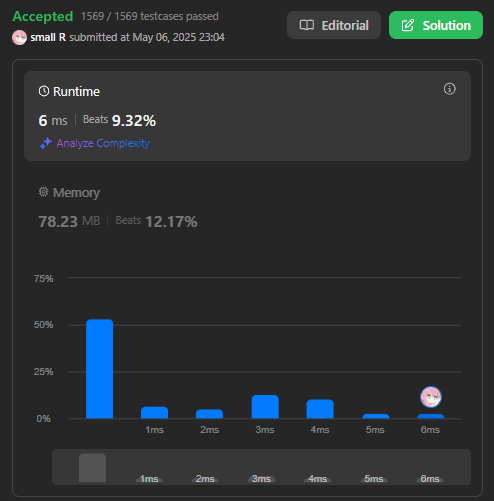

# 💡 LeetCode 2. Add Two Numbers 題目筆記

## 🧠 題目理解

題目給兩個「**反向儲存的 linked list**」，每個節點是一位數字，代表一個整數。
要求你實作「兩數相加」並輸出成相同格式的 linked list。

範例：

```
Input: (2 -> 4 -> 3) + (5 -> 6 -> 4)
Output: 7 -> 0 -> 8
Explanation: 342 + 465 = 807
```

---

## 🥹 初次的思路

剛看到這題時我內心是這樣想的：

```
2 4 3
+5 6 4
-----
7 0 8
```

這樣一行一行相加，好像沒問題～
但實際上我一開始不會操作 linked list（老實說看得有點痛苦 QQ），
於是我突發奇想，請 AI 幫我寫了兩個函數：

### 🛠 轉換工具函數

```cpp
// linked list → vector
vector<int> listToVector(ListNode *head) {
    vector<int> result;
    while (head != nullptr) {
        result.push_back(head->val);
        head = head->next;
    }
    return result;
}

// vector → linked list
ListNode *vectorToList(const vector<int> &nums) {
    ListNode *dummy = new ListNode(0);
    ListNode *current = dummy;
    for (int num : nums) {
        current->next = new ListNode(num);
        current = current->next;
    }
    return dummy->next;
}
```

有了這兩個 function，我就可以用最熟悉的 `vector` 處理！

---

## 🧪 初版嘗試

```cpp
ListNode *addTwoNumbers(ListNode *l1, ListNode *l2)
{
    vector<int> result = {};
    vector<int> nums1 = listToVector(l1);
    vector<int> nums2 = listToVector(l2);

    int maxSize = max(nums1.size(), nums2.size());

    for (int i = 0; i < maxSize; i++)
        result.push_back(nums1[i] + nums2[i]);

    return vectorToList(result);
}
```

### 💥 問題 1：越界崩潰

如果兩個 list 長度不同會出現 `out of range` 錯誤。
解法是使用三元運算子來補 0：

```cpp
int val1 = (i < nums1.size()) ? nums1[i] : 0;
int val2 = (i < nums2.size()) ? nums2[i] : 0;
```

---

## ✨ 最終解法（含進位處理）

```cpp
ListNode *addTwoNumbers(ListNode *l1, ListNode *l2)
{
    vector<int> result = {};
    vector<int> nums1 = listToVector(l1);
    vector<int> nums2 = listToVector(l2);

    int maxSize = max(nums1.size(), nums2.size());
    int carry = 0;

    for (int i = 0; i < maxSize || carry; i++)
    {
        int val1 = (i < nums1.size()) ? nums1[i] : 0;
        int val2 = (i < nums2.size()) ? nums2[i] : 0;

        int sum = val1 + val2 + carry;
        carry = sum / 10;

        result.push_back(sum % 10);
    }

    return vectorToList(result);
}
```

---

## 🤯 關鍵知識補充

### 為什麼需要 `%` 和 `/`？

拿 `999 + 999` 為例：

```
9 + 9 = 18
保留個位數：8
進位 = 1（carry）
```

所以：

```cpp
carry = sum / 10;        // 把多的部分留著
result.push_back(sum % 10);  // 留下個位數
```

---

## 🎯 題目本質

這題本質上就是「**模擬直式加法**」的過程：

- 每位相加
- 加上前一位的進位
- 處理最後多出來的進位

---

## ✅ 最終實作

🔧 包含完整結構 + 測試函數可直接提交！

```cpp
/**
 * Definition for singly-linked list.
 * struct ListNode {
 *     int val;
 *     ListNode *next;
 *     ListNode() : val(0), next(nullptr) {}
 *     ListNode(int x) : val(x), next(nullptr) {}
 *     ListNode(int x, ListNode *next) : val(x), next(next) {}
 * };
 */
class Solution {
public:
    ListNode* vectorToList(const std::vector<int>& nums) {
        ListNode* dummy = new ListNode(0);
        ListNode* current = dummy;

        for (int num : nums) {
            current->next = new ListNode(num);
            current = current->next;
        }

        return dummy->next;
    }

    vector<int> listToVector(ListNode* head) {
        std::vector<int> result;
        while (head != nullptr) {
            result.push_back(head->val);
            head = head->next;
        }
        return result;
    }

    ListNode* addTwoNumbers(ListNode* l1, ListNode* l2) {
        vector<int> result = {};
        vector<int> nums1 = listToVector(l1);
        vector<int> nums2 = listToVector(l2);

        int maxSize = max(nums1.size(), nums2.size());
        int carry = 0;

        for (int i = 0; i < maxSize || carry; i++) {
            int val1 = (i < nums1.size()) ? nums1[i] : 0;
            int val2 = (i < nums2.size()) ? nums2[i] : 0;

            int sum = val1 + val2 + carry;

            carry = sum / 10;

            result.push_back(sum % 10);
        }

        return vectorToList(result);
    }
};
```



---

## 💌 給未來的自己：

這次我們用熟悉的 `vector` 把整個邏輯弄懂，超棒的！
但未來的你，當你更熟悉 `linked list` 操作時，
記得回來挑戰一次「**純正統 linked list 解法**」吧～
這樣你一定會更強的！你做得到的！(๑•̀ㅂ•́)و✧

---
