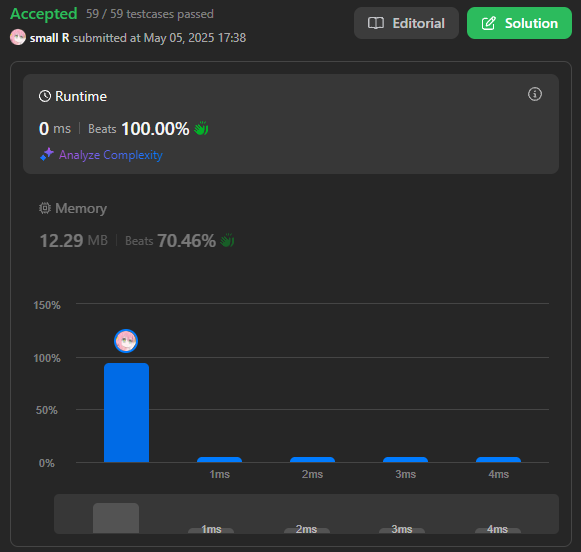

# 🧩 LeetCode 88 - Merge Sorted Array 題解筆記

## 🌱 我的初始想法

第一次解這題的時候，我的思路很直接：
我先創一個 `result` 容器，然後用 loop 把 `nums1` 和 `nums2` 的元素抓出來加進去～
不過我只看了 `nums1[i]` 跟 `nums2[i]`，還寫了條件過濾掉 `0` 的部分（覺得 0 可能是「空值」）～結果…

🙈 **爆了！**
因為 `nums2` 比 `nums1` 短，所以讀超過範圍就發生 `heap-buffer-overflow`，還有我不小心 `push_back()` 成 `nums1[i]` 兩次，完全沒放進 `nums2` 的東西 🫠

```cpp
class Solution {
public:
    vector<int> merge(vector<int>& nums1, int m, vector<int>& nums2, int n) {
        vector<int> result;

        for (int i = 0; i < nums1.size(); i++) {
            if (nums1[i] && nums1[i] != 0) {
                result.push_back(nums1[i]);
            }
            if (nums2[i] && nums2[i] != 0) {
                result.push_back(nums1[i]); // 這邊錯了 🤯
            }
        }

        sort(result.begin(), result.end());
        return result;
    }
};
```

---

## 🧠 第二次思考：根據 m 跟 n 來迴圈！

後來我注意到題目有給 `m` 和 `n`，那我就可以分開用兩個迴圈處理！
我把 `nums1` 前 `m` 個加進 `result`，再把 `nums2` 前 `n` 個也加進 `result`～

我本來以為題目是要我 **回傳一個排序好的 vector**，所以我就乖乖 return `result`～
結果後來才發現… 題目說的是「**直接修改 nums1 的內容**！」Σ(° ロ °)

那我就有兩個選項：

1. `nums1 = result;`（但這樣其實沒改原本的記憶體位置）
2. 用迴圈一個一個把值 assign 回 `nums1`

---

## ✅ 我的解法（成功 AC！）

最後我選擇用 `result` 存資料後，**再一個個 assign 回 `nums1` 的前 `m + n` 位**～這樣就能過囉！

```cpp
class Solution {
public:
    void merge(vector<int>& nums1, int m, vector<int>& nums2, int n) {
        vector<int> result;

        for (int i = 0; i < m; ++i)
            result.push_back(nums1[i]);
        for (int i = 0; i < n; ++i)
            result.push_back(nums2[i]);

        sort(result.begin(), result.end());

        for (int i = 0; i < m + n; ++i)
            nums1[i] = result[i];
    }
};
```

📝 我也有記下這題過程中問過 AI 的問題，希望能越刷越獨立～
👉 [ChatGPT 分享連結](https://chatgpt.com/share/68188861-ca54-8005-86f6-3a5f365504c4)

---

## 🖼️ 提交結果圖：



---

## 💪 給未來的我：挑戰！

你現在用的解法是時間複雜度 `O((m + n) log(m + n))`，空間複雜度 `O(m + n)`～
對剛開始刷 LeetCode 的自己來說，這超棒的！真的要給自己拍拍手～ (｡>ㅅ<｡)♡

**但未來的你更強！以下是你可以挑戰的進階寫法：**

### 🎯 雙指標 + 原地修改版：

- **時間複雜度：** `O(m + n)`
- **空間複雜度：** `O(1)`
- **關鍵思路：** 從「nums1 的尾巴」開始放數字，因為那邊是空的！

> ✨ Hint：從 `p = m + n - 1` 開始倒填

```cpp
int p1 = m - 1;
int p2 = n - 1;
int p = m + n - 1;

while (p1 >= 0 && p2 >= 0) {
    if (nums1[p1] > nums2[p2]) {
        nums1[p--] = nums1[p1--];
    } else {
        nums1[p--] = nums2[p2--];
    }
}
while (p2 >= 0) {
    nums1[p--] = nums2[p2--];
}
```

🧠 這版本是大公司的面試官會期待你會的～
未來的我，你一定可以做到的！我們要挑戰更強的你，不是停留在現在 ✨
